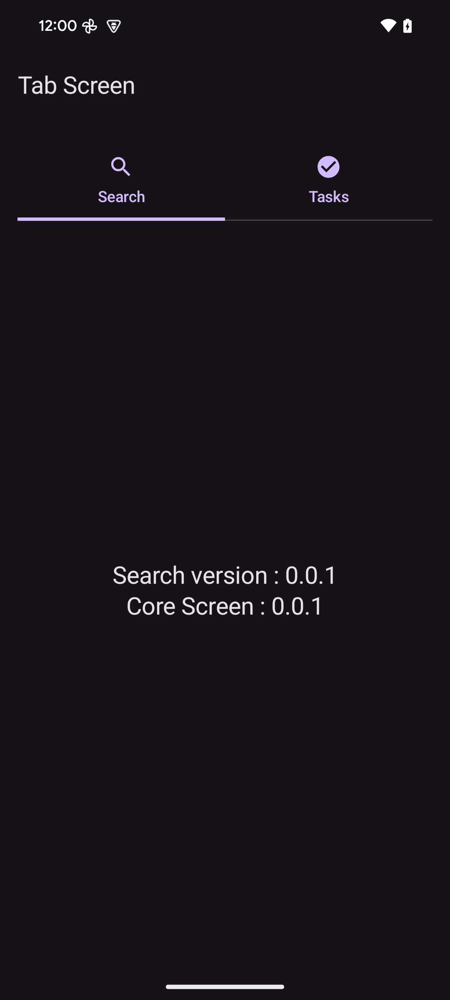
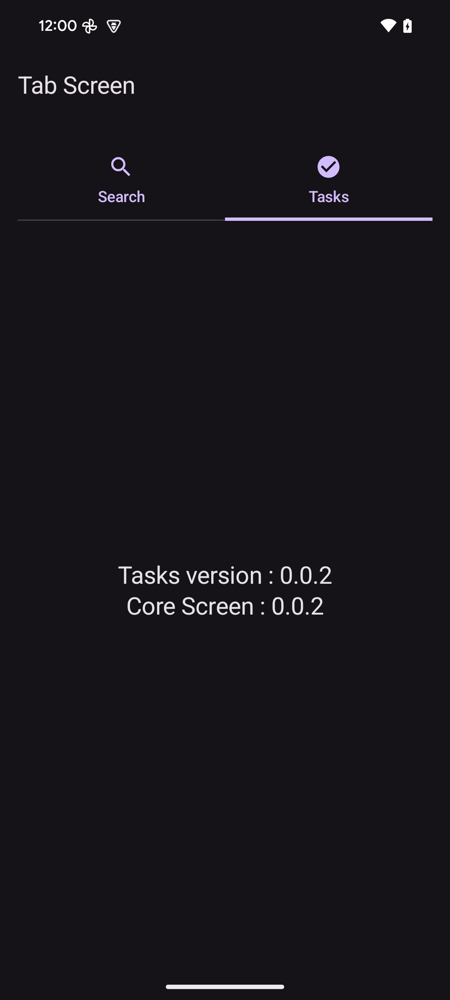

# SampleArtifactConsumer

This is an Android app that consumes the artifacts generated by the PSCORE library.

    
    

The app is to demonstrate how the artifacts can be consumed by an Android app.

The app consumes the following artifacts:

- `com.local.pscore:core:0.0.1`
- `com.local.pscore:tasks:0.0.2`
- `com.local.pscore:search:0.0.1`
  